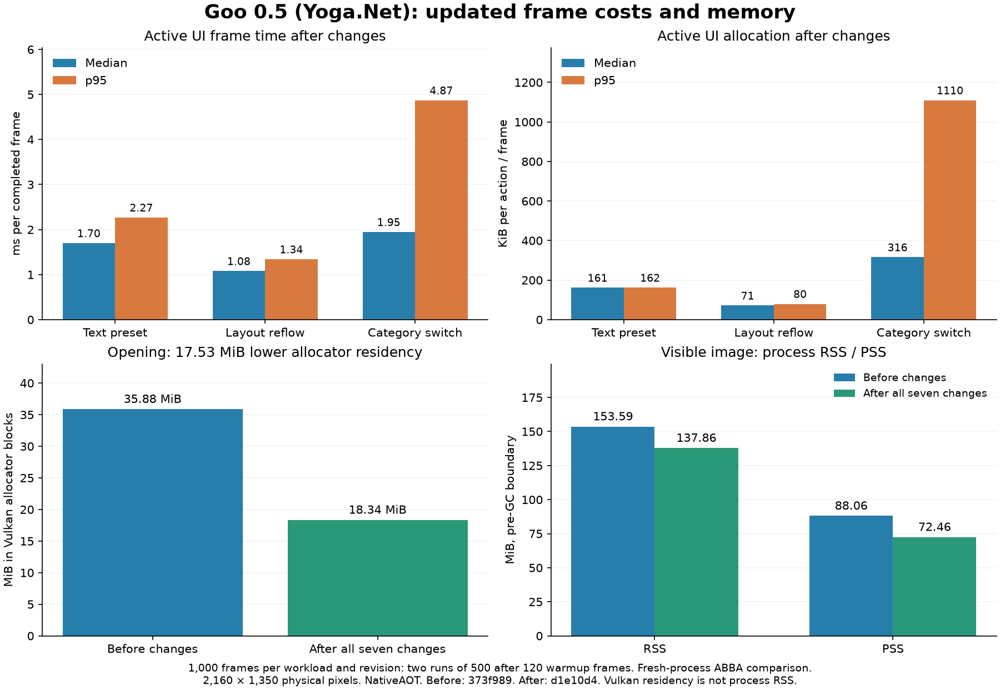

# Updated benchmark chart

The original four-panel format is retained. The upper panels show the completed changes. The lower panels compare fresh measurements before and after all seven changes. The [original chart](evidence/benchmark-update-2026-09-08/original-chart.png) is preserved separately.

| Active workload | Before host median / p95, ms | After host median / p95, ms | Before UI median / p95, KiB | After UI median / p95, KiB |
|---|---:|---:|---:|---:|
| Text preset | 1.681 / 1.963 | 1.699 / 2.269 | 184.2 / 184.4 | 161.5 / 161.7 |
| Layout reflow | 1.094 / 1.301 | 1.079 / 1.341 | 73.5 / 82.7 | 71.4 / 79.7 |
| Category switch | 1.905 / 4.855 | 1.946 / 4.871 | 318.6 / 1114.5 | 316.0 / 1109.7 |

Opening Vulkan allocator residency falls **35.875 to 18.344 MiB**, a **17.531 MiB** reduction. In the visible-image control, RSS falls **153.594 to 137.861 MiB** and PSS falls **88.063 to 72.455 MiB**. Its staging allocation is 16 MiB before and grows to 1 MiB after the changes. The process-memory comparison includes all seven changes, so the entire RSS difference is not assigned to staging alone.

The active controls allocate less, but these runs do not establish a broad CPU improvement. Run medians overlap, and text-preset p95 increases. Category-switch tail cost remains largely unchanged.

The supplemental shader runs show Dither allocating zero UI bytes in all 1,000 updated frames, versus 23,904 bytes per baseline frame. Updated Radial has zero median allocation but an 8,344-byte p95. One Radial process records 237 frames with Build work, while the other records none. These samples are retained. The timing/allocation results do not establish the cause of those rebuilds.

## Measurement and evidence

- Exact main revisions: before `373f989`, after `d1e10d4`. Both use Yoga.Net. No managed-layout measurements or historical prototype numbers are substituted.
- Matching NativeAOT Release builds, speed optimization, EventSource support, G# SDK 0.4.1, Slang 2026.16 and system SDL 3.4.16. Shader assets and SDL hashes match. Diagnostic snapshots are the only library instrumentation changes.
- Fresh-process order: baseline, updated, updated, baseline. Seven workloads per round, each with 120 warmup and 500 measured frames. Total: **14,000 measured frames**, pooled into 1,000 frames per revision/workload. Memory values are medians of two pre-GC boundaries.
- All accepted runs use **2160 × 1350 physical pixels** and three swapchain images. Each has 500 valid, matched CPU/GPU frame records and 500 submission/presentation handoffs. Recorded binaries, environments, counters and resource closure pass validation.
- No builds or profilers overlap timing runs. The host timer excludes the 16 ms pacing delay. It ends at submission/presentation handoff and does not measure scanout or input latency. GPU Main includes nested effects.
- A separate updated visible-image run passes Khronos validation at the correct extent. The initial baseline preflight was height-clamped and is retained as rejected extent evidence, outside the timing matrix.

[CSV numbers](evidence/benchmark-update-2026-09-08/benchmark-numbers.csv), [full results and run variation](evidence/benchmark-update-2026-09-08/chart-results.json), [SVG chart](evidence/benchmark-update-2026-09-08/full-cost-breakdown-updated.svg), and [reproduction instructions](evidence/benchmark-update-2026-09-08/README.md).
