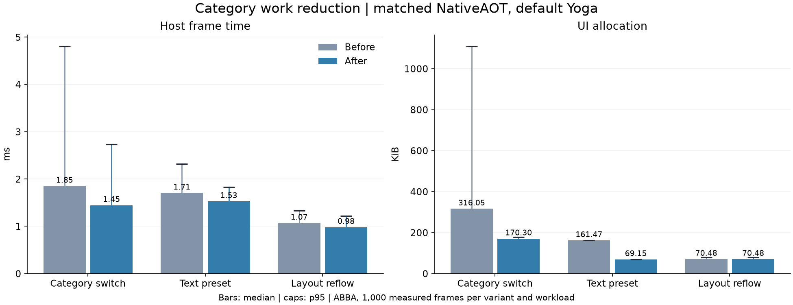

# Component category frame-time reduction

## Result

The retained category implementation reduces measured CPU work and managed
allocation for category changes. It does not improve measured end-to-end
interaction latency. Repeated injection-to-completion observation increased
from 20.473 ms to 26.878 ms at p50. The change is accepted as a bounded CPU
work reduction, with presentation-completion latency still unresolved.

## Change

`MotionChapter` keeps exactly four keyed component-card slots mounted. Each
`MotionComponentSlotCell` owns the original card outer box, including its flex
basis, minimum width, padding, border, title, and spacing. Selected slots use
`Display.Flex`. Other slots use `Display.None`, which excludes them from layout,
paint, input, focus traversal, and accessibility exposure while preserving Cell
and node identity.

Each slot contains a keyed `MotionComponentRegionCell` for its controls.
Category changes rebuild the filter owner and slot outers whose display state
changed. They do not remount or rebuild unchanged card regions. Input callbacks
rebuild their owning region. The footer status text has a separate region, so a
status update does not rebuild the card grid.

The six selection animations remain owned by `MotionChapter`. Their callbacks
invalidate the selection slot. A visible selection card rebuilds normally. A
hidden slot records a revision without rebuilding its hidden subtree, then
applies the latest revision when shown. Reset updates shared state and
invalidates all four slots so hidden regions are current when revealed.

## Matched frame measurements

Lower values are better. Allocation values are managed bytes per measured
frame. Percentages compare candidate with baseline.

| Workload | Metric | Baseline p50 | Candidate p50 | Change | Baseline p95 | Candidate p95 | Change |
| --- | --- | ---: | ---: | ---: | ---: | ---: | ---: |
| Layout reflow control | Host | 1.068 ms | 0.981 ms | -8.2% | 1.332 ms | 1.221 ms | -8.3% |
| Layout reflow control | Allocation | 72,172 B | 72,172 B | 0.0% | 81,576 B | 81,576 B | 0.0% |
| Category change | Host | 1.852 ms | 1.446 ms | -21.9% | 4.809 ms | 2.731 ms | -43.2% |
| Category change | Allocation | 323,632 B | 174,392 B | -46.1% | 1,136,352 B | 182,272 B | -84.0% |
| Text preset | Host | 1.705 ms | 1.527 ms | -10.4% | 2.315 ms | 1.826 ms | -21.2% |
| Text preset | Allocation | 165,344 B | 70,808 B | -57.2% | 165,624 B | 71,072 B | -57.1% |

The unchanged layout control allocation is identical. Its pooled host p50 is
8.2% lower, but its two run medians cross: baseline 0.900 and 1.121 ms,
candidate 1.055 and 0.885 ms. That spread demonstrates run variation. The category result
is larger, appears at p50 and p95, and is paired with a large allocation drop.
Category process medians were 1.798 and 1.897 ms before, versus 1.495 and
1.325 ms after. Both candidate runs beat both baseline runs. This supports the
CPU work conclusion. The smaller text-preset timing change is less conclusive
against control variation, while its allocation reduction is consistent.

## Scheduler measurement

The native scheduler test measures injection to presentation handoff and to
completion observation. It does not measure scanout.

| Repeated action metric | Baseline p50 | Candidate p50 | Change | Baseline p95 | Candidate p95 | Change |
| --- | ---: | ---: | ---: | ---: | ---: | ---: |
| Injection to handoff | 6.846 ms | 6.570 ms | -4.0% | 8.042 ms | 7.978 ms | -0.8% |
| Injection to completion observed | 20.473 ms | 26.878 ms | +31.3% | 27.489 ms | 28.480 ms | +3.6% |

The handoff result is small relative to run variation. Completion observation
is worse at p50 and p95. Therefore this evidence does not establish an
end-to-end latency improvement. Completion is timestamped when the UI thread
observes the present fence, not when hardware signals it. The extra delay is
after handoff. These samples cannot distinguish later observation from later
fence signaling or resource release. No compositor cause or scanout improvement
is established. This remains a separate presentation-retirement investigation.
The first category cycle starts after the initial All Categories view, which
already builds all four cards. It is not a cold application-start measurement.

## Memory and retention

The retained set is fixed at four slot Cells and four card-region Cells. In a
single-category view, three complete card UI and Yoga subtrees remain mounted.
This is a bounded structural retention cost. It does not grow with scrolling,
input, or category changes. The initial All Categories view still constructs
all four cards.

Measured category-workload memory moved as follows:

| Boundary | Baseline | Candidate | Change |
| --- | ---: | ---: | ---: |
| Post-GC total managed memory | 8.021 MiB | 6.594 MiB | -17.8% |
| Process RSS | 156.525 MiB | 147.447 MiB | -5.8% |
| Process PSS | 88.248 MiB | 78.801 MiB | -10.7% |
| Vulkan allocator resident | 16.766 MiB | 16.766 MiB | 0.0% |

These whole-process boundaries are lower for the candidate, but they cannot
isolate retained UI and Yoga memory. They do not disprove the structural cost
of keeping three hidden card subtrees mounted.

## Method

- Source baseline: `5d4b360`. Candidate: `fd104fa`.
- Fixed NativeAOT binaries were used for each variant. Binary SHA-256 values
  were checked before every run.
- The default Yoga.Net layout path ran at a physical extent of 2160 by 1350.
- Frame measurements used forced ABBA order with two fresh processes per
  variant. Each workload pooled 1,000 frames per variant, for 6,000 frames.
- Memory values are medians of the two pre-GC process boundaries, except the
  explicitly labeled post-GC total managed-memory boundary.
- Scheduler measurements used ABBA order across 420 native click actions. Of
  these, 400 were repeated actions and 20 were first-cycle actions.

## Verification

- Strict SDK build passed with 0 warnings and 0 errors.
- Gallery smoke passed all 9 showcases at both tested sizes.
- The full category gate passed category visibility, native text input, focus,
  state across hide and reveal, reset, switch animation, slider, accordion,
  resize, wheel scrolling, readback, and close cleanup.
- All 6 settled category RGBA captures were byte-identical to baseline.
- Source reconstruction checked all 646 files with 0 hash mismatches.
- Archived analysis, CSV aggregation, and plot reproduction passed.

## Evidence

[Reproduction instructions and raw-log inventory](evidence/category-frame-times-2026-09-08/README.md)

- [Frame analysis](evidence/category-frame-times-2026-09-08/category-results.json)
- [Frame measurement table](evidence/category-frame-times-2026-09-08/benchmark-numbers.csv)
- [Scheduler analysis](evidence/category-frame-times-2026-09-08/scheduler-results.json)
- [Scheduler measurement table](evidence/category-frame-times-2026-09-08/scheduler-numbers.csv)
- [Frame-time plot](evidence/category-frame-times-2026-09-08/category-frame-times.svg)
- [Visual comparison](evidence/category-frame-times-2026-09-08/visual-comparison.json)
- [Build verification](evidence/category-frame-times-2026-09-08/validation/verify.log.gz)
- [Category gate log](evidence/category-frame-times-2026-09-08/validation/category-gate-candidate.log.gz)
- [Gallery smoke log](evidence/category-frame-times-2026-09-08/validation/gallery-smoke.log.gz)

## Limits

- Category changes still rebuild the filter owner, resolve changed slot display
  styles, and run required layout and paint work.
- Hidden cards retain full UI and Yoga trees until `MotionChapter` unmounts.
- The implementation is specific to the four current variable-height cards.
- It does not add general virtualization, frame pacing, queued construction, or
  scheduler changes.
